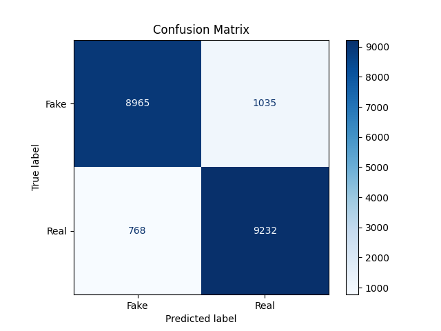
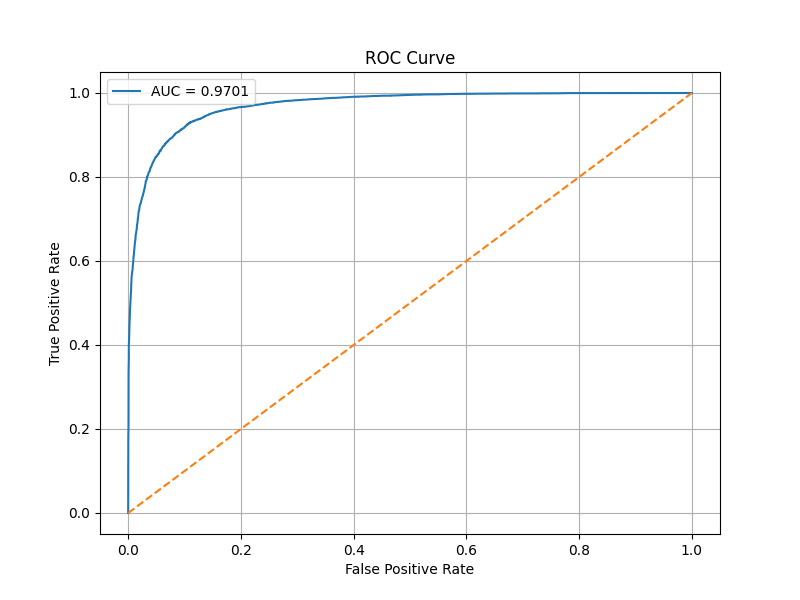

# Hybrid Deepfake Detection: ResNet18 + FFT + LBP

A deepfake detection framework that enhances classification robustness by integrating **Spatial (RGB)**, **Frequency (FFT)**, and **Texture (LBP)** features into a unified 5-channel hybrid representation.

---

# 🚀 Overview

This project targets the subtle artifacts left behind by GANs and diffusion models.

By augmenting standard RGB data with:

- Fast Fourier Transform (FFT)
- Local Binary Patterns (LBP)

the model learns to identify synthetic traces that are often invisible in the standard spatial domain.

---

# ✨ Key Features

- Hybrid 5-Channel Input
  - RGB (3 Channels)
  - FFT Magnitude (1 Channel)
  - LBP (1 Channel)

- Adapter Convolution
  - Maps 5-channel hybrid data into 3-channel space for pretrained CNN compatibility

- Two-Stage Fine-Tuning
  - Stable and efficient transfer learning strategy

- Performance Optimized
  - Mixed Precision Training (FP16)
  - Learning Rate Scheduling
  - Early Stopping

---

# 🏗 Proposed Framework

## 1. Image Augmentation & Feature Extraction

Input images are processed through parallel streams to capture non-spatial artifacts.

### FFT Magnitude Spectrum

Highlights:

- high-frequency anomalies
- checkerboard artifacts
- GAN upsampling traces

### Local Binary Pattern (LBP)

Captures:

- micro-texture inconsistencies
- unnatural smoothness
- synthetic texture patterns

---

## 2. Channel Adaptation

The framework constructs a hybrid 5-channel image:

- RGB → 3 Channels
- FFT → 1 Channel
- LBP → 1 Channel

Since pretrained CNNs expect 3-channel inputs, an Adapter Convolution block converts the hybrid representation into a compatible format.

### Adapter Block

Input:

```text
5 Channels (RGB + FFT + LBP)
```

Process:

```text
3×3 Convolution
Batch Normalization
ReLU Activation
1×1 Convolution
```

Output:

```text
3 Channels
```

optimized for ResNet18.

---

## 3. Classification Pipeline

The adapted feature representation is passed into a pretrained ResNet18 backbone for binary classification.

Classes:

- REAL → Class 0
- FAKE → Class 1

---

# 📉 Two-Stage Training Strategy

| Stage | Strategy | Trainable Modules | Purpose |
|---|---|---|---|
| Stage 1 | Feature Alignment | Adapter Layers Only | Stabilize FFT/LBP integration without disturbing pretrained weights |
| Stage 2 | Fine-Tuning | Layer4 + Classifier | Improve task-specific learning and maximize accuracy |

---

# 📂 Project Structure

```text
deepfake_image_detection/
│
├── data_loader.py
├── data_loader_fft.py
├── baseline_resNet18.py
├── resNet18_fft_lbp.py
├── resNet18_with-frozen_backbone.py
├── req.txt
├── outputs_two_stage_training/
├── .gitignore
└── README.md
```

---

# 📊 Dataset

This project uses the CIFAKE Dataset containing:

- 60,000 Real Images
- 60,000 AI-Generated Images

Dataset Source:

https://www.kaggle.com/datasets/birdy654/cifake-real-and-ai-generated-synthetic-images

Dataset download is handled automatically using `kagglehub`.

---

# 🛠 Installation & Usage

## 1. Clone Repository

```bash
git clone https://github.com/yourusername/deepfake_image_detection.git

cd deepfake_image_detection
```

---

## 2. Install Dependencies

```bash
pip install -r requirements.txt
```

---

## 3. Run Training

```bash
python resNet18_fft_lbp.py
```

---

# 📈 Results & Evaluation

The framework evaluates:

- Accuracy
- Precision
- Recall
- F1 Score
- ROC-AUC

Generated outputs include:

- Confusion Matrix
- ROC Curve
- Best Model Checkpoints

 ## Result for ResNet18 + FFT + LBP:
 ## Confusion Matrix



 ## ROC-Curve

 


---

# 🧬 Research Motivation

Deepfake detection is an evolving challenge.

Modern GANs and diffusion models can generate highly realistic facial structures, making RGB-only detection increasingly unreliable.

However, synthetic images often fail to accurately reproduce:

## Frequency Artifacts

GANs leave characteristic patterns in the Fourier domain due to:

- transposed convolutions
- upsampling operations
- frequency inconsistencies

## Texture Inconsistencies

Synthetic images may contain:

- over-smoothed textures
- repetitive patterns
- unnatural local structures

By explicitly incorporating FFT and LBP features, the framework forces the model to analyze these hidden artifacts, leading to better robustness and generalization.

---

# 🔬 Technologies Used

- Python
- PyTorch
- torchvision
- timm
- OpenCV
- scikit-image
- scikit-learn
- matplotlib
- kagglehub

---

P.S: Currently working on generalization of the Model

# 👩‍🔬 Author

Swetasree Banik

M.Sc Final Project / Deepfake Detection Research
